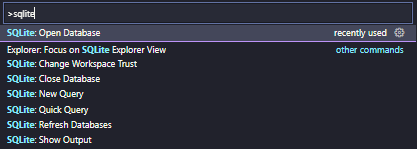
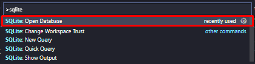
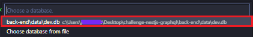
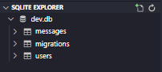

<h1 align="center">
    
</h1>

## 💻 Project summary

This challenge I realized consists of creating a message board where the user can register and/or authenticate only using the email, soon after logged in he can post a message on the wall and the message can be deleted. This application has a very simple design to just serve as a basis and show how it works.

## 🛠 Technologies

To better understand the technologies that were used in this project, the **backend** and **frontend** were separated in the descriptions, below are the technologies:

First, let's talk about the **backend**, it was created using **Node.js**, **Typescript**, **Nest.js**, **GraphQL**, Database **SQLite** the following dependencies:

- **[Apollo Server Express](https://www.npmjs.com/package/apollo-server-express)** - Is a community-maintained open-source GraphQL server that works with many Node.js HTTP server frameworks.

- **[Data Loader](https://www.npmjs.com/package/dataloader)** - Is a generic utility to be used as part of your application's data fetching layer to provide a simplified and consistent API over various remote data sources such as databases or web services via batching and caching.

- **[Reflect Metadata](https://www.npmjs.com/package/reflect-metadata)** - Allows you to do runtime reflection on types. The native (non reflect-metadata) version of type inference is much poorer than reflect-metadata and consists only of type and is instance

- **[Rimraf](https://www.npmjs.com/package/rimraf)** - Is an executable that is used to clean the installed node packages in a node based project.

- **[RxJS](https://www.npmjs.com/package/rxjs)** - Is Reactive Extension for Javascript. It is a javascript library that uses observables to work with reactive programming that deals with asynchronous data calls, callbacks and event-based programs.

- **[TypeGraphQL](https://www.npmjs.com/package/type-graphql)** - Create GraphQL schema and resolvers with TypeScript, using classes and decorators!

- **[TypeORM](https://www.npmjs.com/package/typeorm)** - Is an ORM that can run in NodeJS, Browser, Cordova, PhoneGap, Ionic, React Native, NativeScript, Expo, and Electron platforms and can be used with TypeScript and JavaScript (ES5, ES6, ES7, ES8). Its goal is to always support the latest JavaScript features and provide additional features that help you to develop any kind of application that uses databases - from small applications with a few tables to large scale enterprise applications with multiple databases.

- **[Voyager](https://www.npmjs.com/package/voyager)** - Is a static site generator with a built-in task runner, inspired by gulp and Google's Web Starter Kit.

- **[ESLint](https://www.npmjs.com/package/eslint)** - Is a tool for identifying and reporting on patterns found in ECMAScript/JavaScript code. In many ways, it is similar to JSLint and JSHint with a few exceptions

- **[Jest](https://www.npmjs.com/package/jest)** - Is a JavaScript testing framework designed to ensure correctness of any JavaScript codebase. It allows you to write tests with an approachable, familiar and feature-rich API that gives you results quickly.

- **[Prettier](https://www.npmjs.com/package/jest)** - Is an opinionated code formatter. It enforces a consistent style by parsing your code and re-printing it with its own rules that take the maximum line length into account, wrapping code when necessary.

- **[Supertest](https://www.npmjs.com/package/supertest)** - Module provides a high-level abstraction for testing HTTP, while still allowing you to go to the lower-level API provided by superagent.

Last but not least, let's talk about the **frontend**, it was created using **React.js**, **Typescript**, **GraphQL**, **Apollo** and the following dependencies :

- **[History](https://www.npmjs.com/package/history)** - library lets you easily manage session history anywhere JavaScript runs. A history object abstracts away the differences in various environments and provides a minimal API that lets you manage the history stack, navigate, and persist state between sessions.

- **[Styled Components](https://styled-components.com/)** - Is a library for React and React Native that allows you to use component-level styles in your application that are written with a mixture of JavaScript and CSS using a technique called CSS-in-JS.

## 🔨 Local Installation

You need **[Node.js](https://nodejs.org)** version 10 or higher, but if you want to use **[Yarn](https://yarnpkg.com/)** you can also just have it on your computer to continue.

```bash
git clone https://github.com/jhonywalkeer/typescript-node.git
$ cd messages-board

$ cd backend
$ npm install or yarn install

$ cd frontend
$ npm install or yarn install
```

To run the backend only:

```bash
$ cd messages-board
$ cd backend

# Development
$ npm start or yarn start

# Watch mode
$ npm start:dev or yarn start:dev

# Production mode
$ npm start:prod or yarn start:prod
```

To run the GraphQL Playground available on the backend:

```bash
$ cd messages-board
$ cd backend
$ npm start or yarn start

Access the link: http://localhost:3333/graphql
```

To test our backend:

```bash
$ cd messages-board
$ cd backend

# Unit tests
$ npm test or yarn test

# E2E tests
$ npm test:e2e or yarn test:e2e

# Test coverage
$ npm test:cov or yarn test:cov
```

To run the database only:

To run the SQLite database in a simple way, there is a way to access the VSCode itself where you just need to install the extension [SQLite from alexcvzz](https://marketplace.visualstudio.com/items?itemName=alexcvzz.vscode-sqlite) and perform the following steps:

- First of all, access the project through the VSCode:

```bash
$ cd messages-board
$ cd backend
$ cd code .
```

After accessing, press the shortcut keys `CTRL + SHIFT + P` and type `sqlite` (remember to have the extension installed because if it isn't, it won't work) and you will be presented with the following options:

<h1 align="center">
    
</h1>

Now select the option `SQLite: Open Database` and select the database of the project which is named `dev.db`

<h1 align="center">
    
</h1>

<h1 align="center">
    
</h1>

There will be available a tab named `SQLITE EXPLORER` and now you can view the database inside VSCode in a simple way

<h1 align="center">
    
</h1>

To run the frontend only:

```bash
$ cd messages-board
$ cd frontend

# Development
$ npm start or yarn start

# Production mode
$ npm build or yarn build
```

## 📖 License

This project is under license from MIT. See the [LICENSE](LICENSE.md) file for more details.
